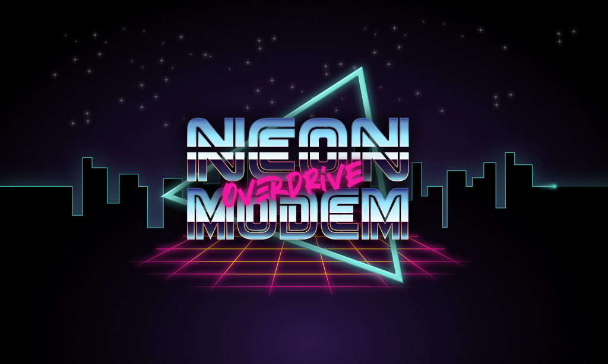

Neon Modem Overdrive
--------------------

[Chat on Matrix](https://matrix.to/#/%21PHlbgZTdrhjkCJrfVY%3Amatrix.org)



[*Neon Modem Overdrive*][neonmodem] is a [BBS][wiki-bbs]-style command line client that 
supports [Discourse][discourse], [Lemmy][lemmy], [Lobsters][lobsters] and 
[Hacker News][hackernews] as backends, and seamlessly integrates all of them 
into a streamlined TUI. And yes, you heard that right, I really did call it 
*Neon Modem Overdrive*.

*Neon Modem* is built in Go, using [Charm's Bubble Tea][bubbletea] TUI 
framework, but implements an own *window manager* (or *compositor* if you want) 
that allows it to use a third dimension, on top of the two dimensional rendering 
that Bubble Tea offers today. With that it is possible to display dialogs on top 
of one another, in order to offer a smoother UI experience.

[More info here!](https://xn--gckvb8fzb.com/get-the-bbs-scene-vibes-back-with-neonmodem-overdrive/)


## Support

| System             | Available          | List Forums        | List Posts         | List Replies       | Create Post        | Create Reply       |
| :----------------- | :----------------: | :----------------: | :----------------: | :----------------: | :----------------: | :----------------: |
| Discourse          | :heavy_check_mark: | :heavy_check_mark: | :heavy_check_mark: | :heavy_check_mark: | :heavy_check_mark: | :heavy_check_mark: |
| Lemmy              | :heavy_check_mark: | :heavy_check_mark: | :heavy_check_mark: | :heavy_check_mark: | :heavy_check_mark: | :heavy_check_mark: |
| Lobsters           | :heavy_check_mark: | :heavy_check_mark: | :heavy_check_mark: | :heavy_check_mark: |                    |                    |
| Hacker News        | :heavy_check_mark: | :heavy_check_mark: | :heavy_check_mark: | :heavy_check_mark: |                    |                    |
| RSS+Disqus/Isso(?) |                    |                    |                    |                    |                    |                    |
| Superhighway84     |                    |                    |                    |                    |                    |                    |
| NNTP               |                    |                    |                    |                    |                    |                    |


[neonmodem]: https://neonmodem.com
[wiki-bbs]: https://en.wikipedia.org/wiki/Bulletin_board_system
[discourse]: https://github.com/discourse
[lemmy]: https://github.com/LemmyNet
[lobsters]: https://github.com/lobsters/lobsters
[hackernews]: https://news.ycombinator.com
[bubbletea]: https://github.com/charmbracelet/bubbletea


## Installation

### From Release

Download the [latest
release](https://github.com/mrusme/neonmodem/releases/latest) and unpack
it:

```sh
$ tar -xzf ./neonmodem_*.tar.gz
```

The binary is called `neonmodem`. Feel free to move it to e.g. `/usr/local/bin`.


### From Sauce

Clone this repository

- from [GitHub](https://github.com/mrusme/neonmodem)
  ```sh
  $ git clone git@github.com:mrusme/neonmodem.git
  ```

Then cd into the cloned directory and run:

```sh
make
```

The binary is called `neonmodem`. Feel free to move it to e.g. `/usr/local/bin`.


## Configuration

Before launching *Neon Modem Overdrive* it requires initial setup of the 
services (a.k.a. *systems*). Run `neonmodem connect --help` to find out more.

Connecting a service will add it to the configuration TOML.

### Linux/Unix
`~/.config/neonmodem.toml`

### MacOS
`$HOME/Library/Application\ Support/neonmodem.toml`


### Systems


#### Discourse

For connecting to a Discourse instance you'll need to have an active account on 
that instance. *Neon Modem* will store the instance URL, username and a user 
key, but no password.

```sh
neonmodem connect --type discourse --url https://www.keebtalk.com
```


#### Lemmy

For connecting to a Lemmy instance you'll need to have an active account on that 
instance. *Neon Modem* will store the instance URL, username and password.

```sh
neonmodem connect --type lemmy --url https://lemmy.ml
```


#### Lobsters

For connecting to a Lobsters instance you won't need an account, as the 
integration is read-only. *Neon Modem* will store the instance URL.

```sh
neonmodem connect --type lobsters --url https://lobste.rs
```


#### Hacker News

For connecting to Hacker News you won't need an account, as the integration is 
read-only.

```sh
neonmodem connect --type hackernews
```


### UI

The UI can be fully customized via the `Theme` section in the configuration 
file. To reset settings, all theme related configurations can simply be deleted 
from the configuration.


## Run

After setup *Neon Modem* can be launched by calling `neonmodem` without any 
arguments. It will briefly display a splash screen, then switch to the posts 
list, which will aggregate the latest posts from all connected systems. A 
progress icon will be visible in the header while network requests are loading.


### Usage


#### Navigation

In the posts list:

- `j`: Scroll down
- `k`: Scroll up
- `r`/`enter`: Open selected post
- `n`: Write new post in on the system/forum of the current selected post
- `C-e`: Open system selector
- `C-t`: Open forum selector
- `q`/`esc`: Quit

In the post view dialog:

- `r`: Reply to post
- `#r`: Reply to specific comment # in post, e.g. `3r` to reply to the reply #3
- `z`: Load older replies (if available)
- `esc`: Close dialog

In the new post / new reply dialog:

- `tab`: Switch between elements (only in new post dialog)
- `C-s`: Submit post/reply
- `esc`: Close dialog


## FAQ

- **Q:** The post view is really slow when using a large terminal.\
  **A:** Turning off image rendering will improve performance significantly on 
  very large terminal windows and can be done by setting `RenderImages = false` 
  in the configuration.
- **Q:** Can I haz Reddit?\
  **A:** I won't do the heavy lifting of integrating a proprietary platform with 
  a $15 billion valuation that can't even be bothered to maintain a solid set of 
  client API libraries. If you feel like, go ahead and PR!

