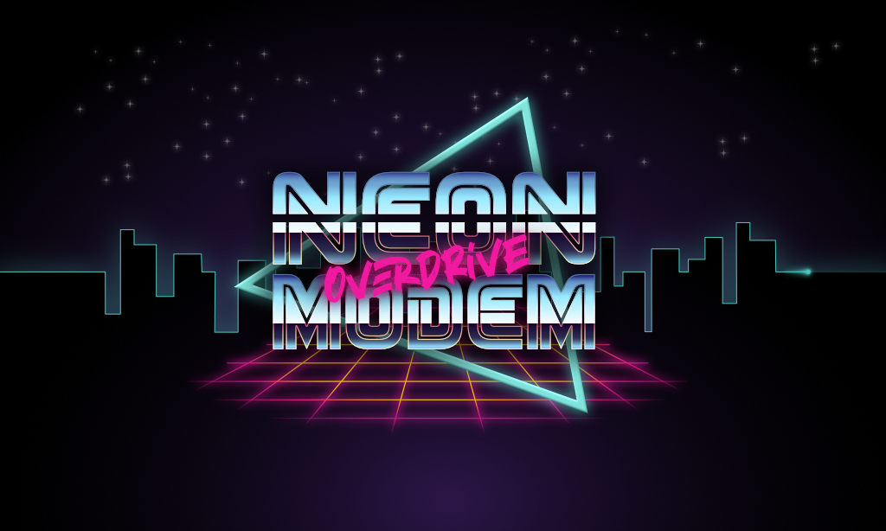

## Neon Modem Overdrive

[](https://xn--gckvb8fzb.com/segv/)



[](https://xn--gckvb8fzb.com/contact/)

[Neon Modem Overdrive][neonmodem] is a [BBS][wiki-bbs]-style command line client
that supports [Hyperuplink][hyperuplink], [Discourse][discourse],
[Lemmy][lemmy], [Lobsters][lobsters] and [Hacker News][hackernews] as backends,
and seamlessly integrates all of them into a streamlined TUI. And yes, you heard
that right, I really did call it Neon Modem Overdrive.

Neon Modem is built in Go, using [Charm's Bubble Tea][bubbletea] TUI framework.

[More info here!](https://xn--gckvb8fzb.com/get-the-bbs-scene-vibes-back-with-neonmodem-overdrive/)

## Support

| System        |     Available      |    List Forums     |     List Posts     |    List Replies    |    Create Post     |    Create Reply    |
| :------------ | :----------------: | :----------------: | :----------------: | :----------------: | :----------------: | :----------------: |
| [Hyperuplink] | :heavy_check_mark: | :heavy_check_mark: | :heavy_check_mark: | :heavy_check_mark: | :heavy_check_mark: | :heavy_check_mark: |
| Discourse     | :heavy_check_mark: | :heavy_check_mark: | :heavy_check_mark: | :heavy_check_mark: | :heavy_check_mark: | :heavy_check_mark: |
| Lemmy         | :heavy_check_mark: | :heavy_check_mark: | :heavy_check_mark: | :heavy_check_mark: | :heavy_check_mark: | :heavy_check_mark: |
| Lobsters      | :heavy_check_mark: | :heavy_check_mark: | :heavy_check_mark: | :heavy_check_mark: | :heavy_check_mark: | :heavy_check_mark: |
| Hacker News   | :heavy_check_mark: | :heavy_check_mark: | :heavy_check_mark: | :heavy_check_mark: | :heavy_check_mark: | :heavy_check_mark: |

Creating posts and replies needs an account on the system. Every system can also
be connected without one, for reading only.

[neonmodem]: https://neonmodem.com
[wiki-bbs]: https://en.wikipedia.org/wiki/Bulletin_board_system
[discourse]: https://github.com/discourse
[lemmy]: https://github.com/LemmyNet
[lobsters]: https://github.com/lobsters/lobsters
[hackernews]: https://news.ycombinator.com
[bubbletea]: https://github.com/charmbracelet/bubbletea
[hyperuplink]: https://hyperup.link

## Installation

### From Release

Download the
[latest release](https://github.com/mrusme/neonmodem/releases/latest) and unpack
it:

```sh
$ tar -xzf ./neonmodem_*.tar.gz
```

The binary is called `neonmodem`. Feel free to move it to e.g. `/usr/local/bin`.

### From Sauce

Clone this repository

```sh
$ git clone https://tty.fail/mrus/neonmodem.git
```

Then cd into the cloned directory and run:

```sh
make
```

Building needs Go 1.26.7 or newer. The binary is called `neonmodem`. Feel free
to move it to e.g. `/usr/local/bin`.

For Arch Linux an AUR package is available here:
https://aur.archlinux.org/packages/neonmodem

Install with your favorite AUR helper.

On NetBSD, a package is available from the official repositories. To install it,
simply run `pkgin install neonmodem`.

## Configuration

Before launching Neon Modem Overdrive it requires initial setup of the services
(a.k.a. _systems_). Run `neonmodem connect --help` to find out more.

Connecting a service will add it to the configuration TOML. The configuration
file location depends on the operating system. On Unix systems, it is in
`$XDG_CONFIG_HOME/neonmodem.toml` if `$XDG_CONFIG_HOME` is non-empty, otherwise
`$HOME/.config/neonmodem.toml` is used. On Darwin, the configuration is in
`$HOME/Library/Application Support/neonmodem.toml`. On Windows, it is in
`%AppData%\neonmodem.toml`.

Connecting a system that is already connected asks whether to keep the existing
connection or to replace it. The previous credentials stay valid on the site
until you revoke them there, since Neon Modem can't do that for every system.

Credentials are stored in plain text unless they are read from a command, so the
file is created with mode `0600`. When the file can't be written, for example
because it's a link into the Nix store, the command prints the `[[Systems]]`
tables to add by hand.

**Note:** Comments in the file are lost on a write.

### Credentials

Every credential can be read from a command instead of being stored in the file.
Add `_cmd` to its name and use the command as the value:

```toml
[Systems.Config.credentials]
username = 'vera'
token_cmd = 'pass show lemmy/token'
```

`neonmodem connect` asks for every credential whether to enter it or to read it
from a command, and stores only the command. When both `token` and `token_cmd`
are set, the command is used.

The commands run when Neon Modem starts, before the interface opens. They run
with `$SHELL -c` (`cmd.exe` on Windows) in the current terminal and environment,
so prompts from tools like `pass` and `gpg-agent` work. The first line a command
prints to stdout is used as the credential. Prompts have to go to stderr or the
terminal, and `pinentry-curses` needs `GPG_TTY` to be exported.

A command that exits with a status other than 0, prints an empty first line or
runs longer than 60 seconds makes a system unavailable.

### Open with

`OpenWith` entries define commands that run on the post shown in the post view.
Each entry has a `name`, which the dialog lists, and a `cmd`:

```toml
[[OpenWith]]
name = 'Save page'
cmd = 'wget -q -P ~/Downloads "$NM_POST_URL"'

[[OpenWith]]
name = 'Bookmark in nb'
cmd = 'nb bookmark "$NM_POST_URL" --tags incoming'
```

`O` in the post view lists the commands. The picked command runs in the
background with `$SHELL -c` (`cmd.exe` on Windows) and gets these variables:

| Variable          | Value                                 |
| :---------------- | :------------------------------------ |
| `NM_SYSTEM_TYPE`  | the system's type, e.g. `lemmy`       |
| `NM_SYSTEM_URL`   | the system's URL                      |
| `NM_FORUM_ID`     | the forum's ID on that system         |
| `NM_FORUM_NAME`   | the forum's name                      |
| `NM_POST_ID`      | the post's ID on that system          |
| `NM_POST_URL`     | the post's page, which `o` opens      |
| `NM_POST_SUBJECT` | the post's title                      |
| `NM_POST_CREATED` | the creation time in RFC 3339, in UTC |
| `NM_POST_LINK`    | the linked page of a link post        |

A value that doesn't apply is empty and t'he values never become part of the
command line, so post content can't run as code.

**Note:** Quote the variables, as in `"$NM_POST_URL"`, because the shell splits
unquoted values into words. On Windows, they're written as `%NM_POST_URL%`.

The command's output, up to 1000 lines per stream, and its exit status are
written to the log. Keep in mind that commands have no terminal. This means that
programs that need one fail, and interactive tools have to open their own
window, for example with `tmux new-window`. When Neon Modem quits, it ends the
commands that still run, including the programs they started. `setsid -f` in
front of a program keeps it running.

**Note:** On Unix, commands from a configuration file that every user can write
to, or that belongs to a user other than you or root, are not run for safety
reasons.

### Systems

#### Hyperuplink

For connecting to a Hyperuplink instance you'll need to have an active account
on that instance. Neon Modem will store the instance URL, username and API key.

```sh
neonmodem connect --type hyperuplink --url https://api.hyperup.link
```

#### Discourse

For connecting to a Discourse instance with an account, Neon Modem will open the
browser to authorize a user API key and store the instance URL, username and the
key, but no password. The key can also be read from a command. Neon Modem then
shows the key once, so it can be saved e.g. in a password manager. It stays in
the terminal's scrollback until that is cleared. Choose _No account_ when asked
for the username to connect without an account, which allows you to read public
categories, but not posted anything. The key is checked once before it's stored,
and a key the instance stops accepting later makes the status line name the
connect command.

```sh
neonmodem connect --type discourse --url https://www.keebtalk.com
```

#### Lemmy

For connecting to a Lemmy instance with an account, Neon Modem logs in once and
stores the instance URL, username and the session token Lemmy issues, but no
password. For accounts with two-factor authentication, the connect command asks
for the current code from the authenticator app. The token can also be read from
a command. Neon Modem then shows it once, so it can be saved e.g. in a password
manager.

The session stays valid until it's ended on the server, for example by a
password change. Neon Modem then lists nothing from that instance and shows the
connect command to run. Make sure to restart Neon Modem after running it.

**Note:** Replacing a connection doesn't end its old session. A password change,
however, ends all of them.

**Important:** Lemmy connections made with Neon Modem 1.x store a password
instead of a token and have to be connected again.

Choose _No account_ when asked for the username to connect without an account.
The connect command also asks which feed to list. Either `subscribed`, the
default feed, requiring an account, `local` or `all`. The choice is stored as
`listing` in the system's `options` table.

```sh
neonmodem connect --type lemmy --url https://lemmy.ml
```

#### Lobsters

Lobsters has no API for posting, so Neon Modem logs in through the site's login
form and posts through its web forms, like a browser would. With an account, the
instance URL, username and password are stored. Choose _No account_ when asked
for the username to connect for reading only. Accounts with two-factor
authentication can't be used for posting as of right now.

```sh
neonmodem connect --type lobsters --url https://lobste.rs
```

#### Hacker News

Hacker News has no API for posting either, so Neon Modem uses the site's login
and submission forms. With an account, username and password are stored. Choose
_No account_ when asked for the username to connect for reading only. The forums
are Ask HN, Show HN and Jobs HN, while top and new stories are sort orders.
Posting from the Ask HN or Show HN forum prefixes the title accordingly.

```sh
neonmodem connect --type hackernews
```

### UI

The UI can be fully customized via the `Theme` section in the configuration
file. Colors are given as `Light` and `Dark` pairs and the one that matches the
terminal background is used. To reset settings, all theme related configurations
can simply be deleted from the configuration.

## Run

After setup Neon Modem can be launched by calling `neonmodem` without any
arguments. It will briefly display a splash screen (any key skips it), then
switch to the posts list, which aggregates the latest posts from all connected
systems. Each system's posts appear as soon as they're loaded. Errors from
single systems are shown in a line below the header as well as in the log inside
`~/.cache/neonmodem.log`.

### Usage


#### Navigation

In the posts list:

- `j`: Scroll down
- `k`: Scroll up
- `/`: Filter the list
- `r`/`enter`: Open selected post
- `n`: Write new post in on the system/forum of the current selected post
- `C-r`: Reload the posts list
- `C-e`: Open system selector
- `C-t`: Open forum selector
- `C-o`: Open sort order selector
- `!`: Show the recent notices
- `esc`: Cancel or clear the filter
- `C-q`: Quit, from every view and dialog

In the post view dialog:

- `j`/`k`: Scroll
- `r`: Reply to post
- `#r`: Reply to specific comment # in post, e.g. `3r` to reply to the reply #3
- `z`: Load older replies (if available)
- `o`: Open the post in the browser
- `O`: Open the post with one of the configured commands, see _Open with_
- `esc`: Close dialog

In the new post / new reply dialog:

- `tab`: Switch between elements (only in new post dialog)
- `C-s`: Submit post/reply
- `esc`: Close dialog

**Note:** A post whose body is a single URL is submitted as a link post on
systems that distinguish links from text posts (e.g. Hacker News).

#### Sorting

The posts list is sorted by New by default. `C-o` opens the sort order selector
with New, Active, Hot, Top for the past day, week, month or year or for all
time, and Most comments.

| Order         |     Discourse      |       Lemmy        |      Lobsters      |    Hacker News     |    Hyperuplink     |
| :------------ | :----------------: | :----------------: | :----------------: | :----------------: | :----------------: |
| New           | :heavy_check_mark: | :heavy_check_mark: | :heavy_check_mark: | :heavy_check_mark: |                    |
| Active        | :heavy_check_mark: | :heavy_check_mark: | :heavy_check_mark: |                    | :heavy_check_mark: |
| Hot           | :heavy_check_mark: | :heavy_check_mark: | :heavy_check_mark: | :heavy_check_mark: |                    |
| Top           | :heavy_check_mark: | :heavy_check_mark: |                    | :heavy_check_mark: |                    |
| Most comments | :heavy_check_mark: | :heavy_check_mark: |                    |                    |                    |

A system without the chosen order keeps its own order, or sorts the posts it
listed by date or replies for New and Most comments. The line below the header
points out those systems. With all systems selected, New sorts every post by
date, and every other order mixes the systems' lists by position, so no system's
posts sink to the bottom.

**Note:** A Lobsters tag supports only New, and Jobs HN only New and Hot.

The order at start is set with `Sort` in the configuration, for example
`Sort = 'top-week'`, or through `NEONMODEM_SORT`. The keys are `new`, `active`,
`hot`, `top-day`, `top-week`, `top-month`, `top-year`, `top-all` and `comments`.

## FAQ

- **Q:** The post view is really slow when using a large terminal.\
  **A:** Turning off image rendering will improve performance significantly on
  very large terminal windows and can be done by setting `RenderImages = false`
  in the configuration.
- **Q:** Can I haz Reddit?\
  **A:** I won't do the heavy lifting of integrating a proprietary platform with
  a $15 billion valuation that can't even be bothered to maintain a solid set of
  client API libraries. If you feel like, go ahead and PR!

## License

Copyright © 2026 [マリウス](https://xn--gckvb8fzb.com) and the Neon Modem
Overdrive authors.

Neon Modem Overdrive is released under Version 1.1 of the
[SEGV License](https://xn--gckvb8fzb.com/segv/), whose full text is included in
the [LICENSE](LICENSE) file.
